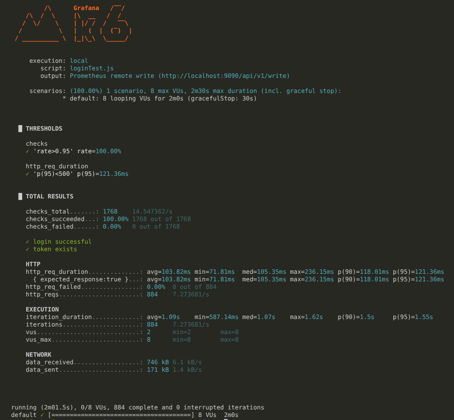
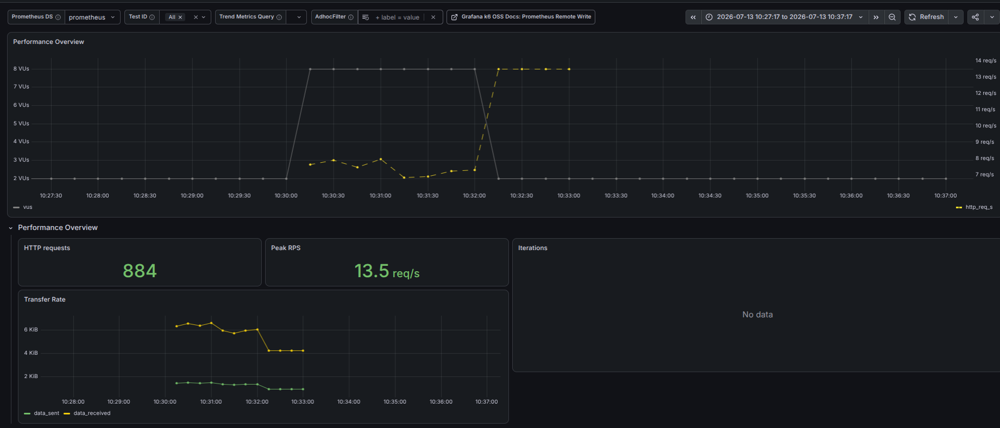
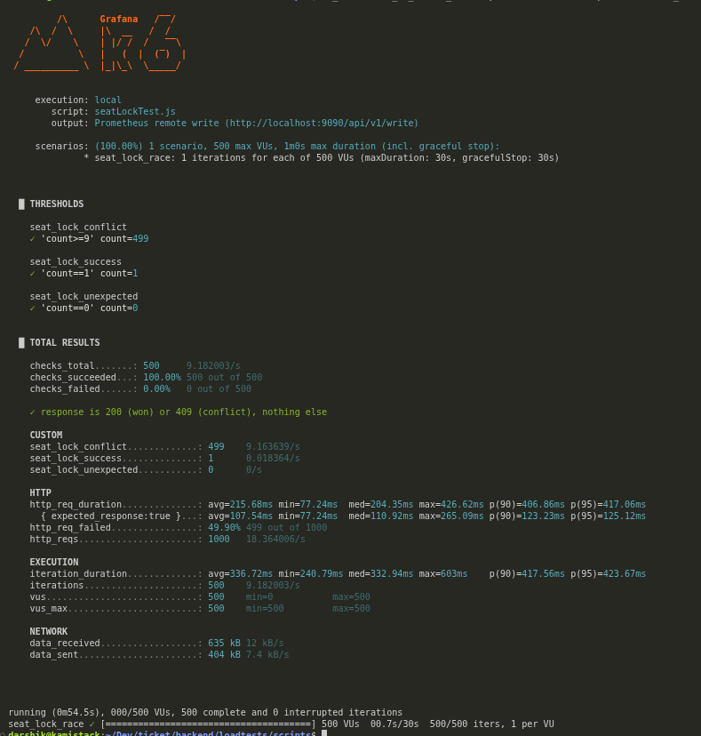
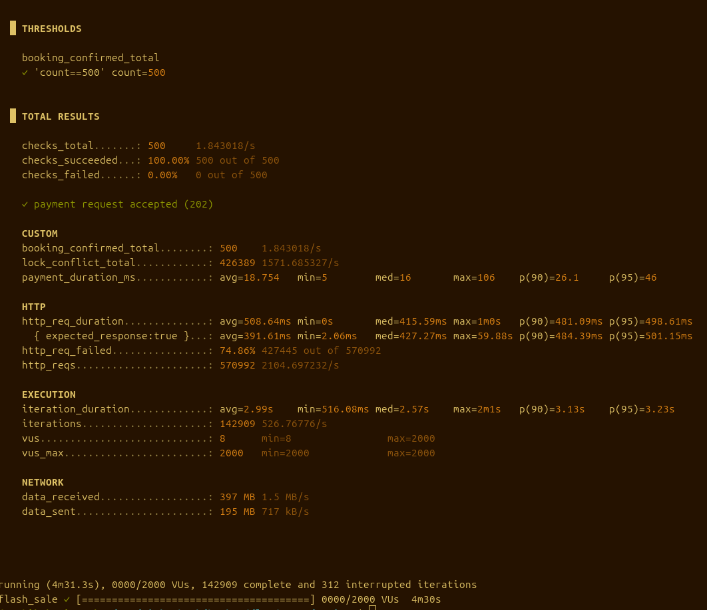
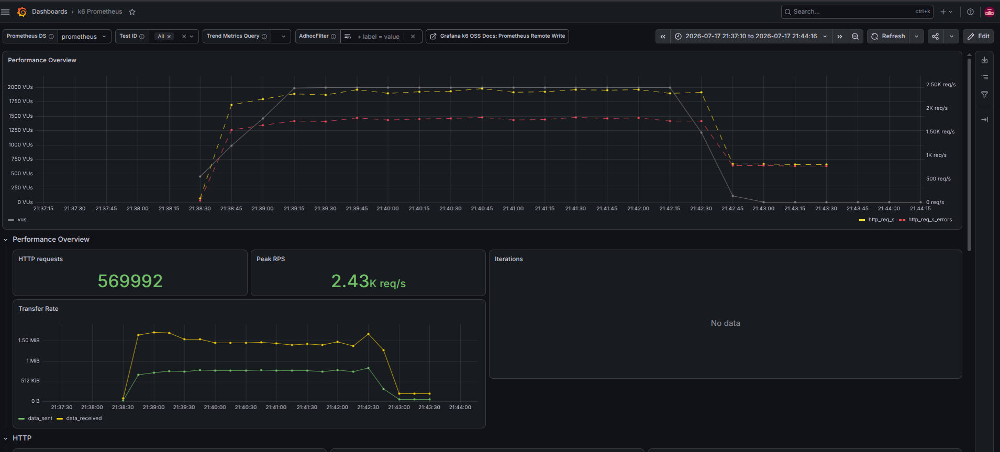
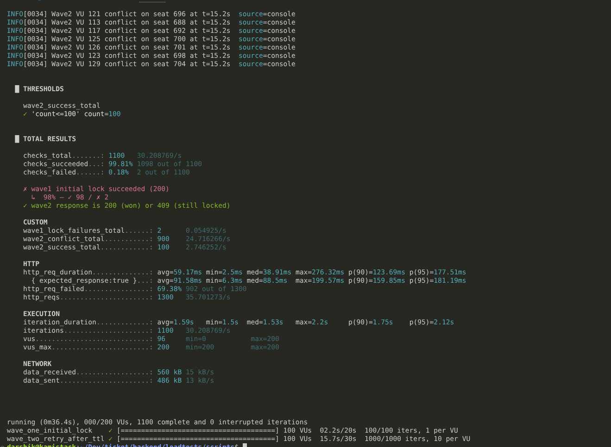
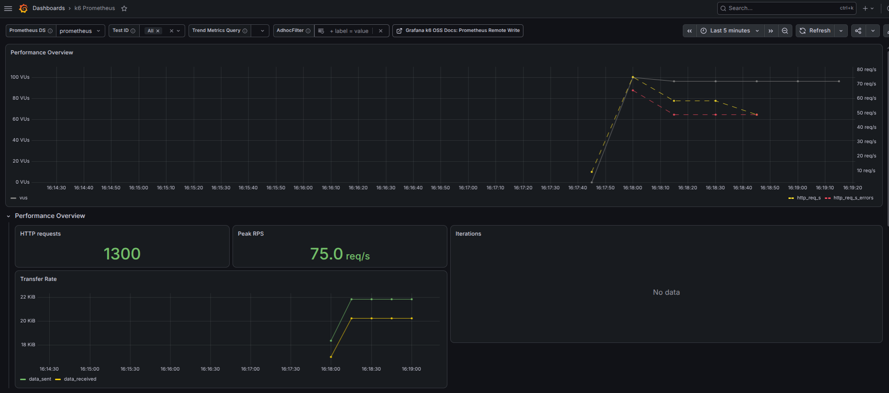
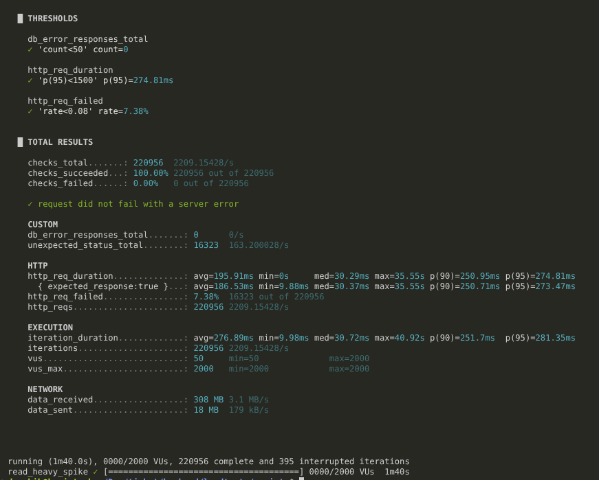
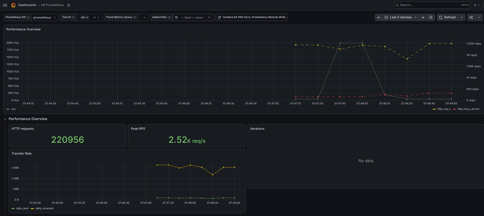

# TicketBook — Load Test & Resilience Report

This is the extensive report of every concurrency and load test run against TicketBook's booking pipeline. It proves to answer one question with evidence, not assertion: **can two users ever end up with the same seat?**

Tests in this report targets the same architectural chain:

```
Client → Express API → Redis (atomic seat lock, Lua script) → BullMQ (paymentQueue) → PaymentWorker → Postgres (Prisma transaction)
```

All tests were run with [k6](https://k6.io/), with metrics streamed live to Prometheus via k6's remote-write output and visualized in Grafana using the official `Grafana k6 Prometheus` dashboard.

## Table of Contents

- [Tools](#tools)
- [0. Auth Load Base (Login Test)](#0-auth-load-base-login-test)
- [1. Atomic Lock Race Condition Test](#1-atomic-lock-race-condition-test)
- [2. Flash Sale End-to-End Flow Test](#2-flash-sale-end-to-end-flow-test)
- [3. Seat Expiry (TTL) Leak Test](#3-seat-expiry-ttl-leak-test)
- [4. Event Page Spike Test](#4-event-page-spike-test)
- [Summary of Findings](#summary-of-findings)
- [Get Started with Tests](#get-started-with-tests)

---

## Tools

Skip this section from the table of contents if you are only interested in the report

### Prometheus - Time Series Database

Prometheus is a monitoring system and time-series database that stores metrics over time.

Without Prometheus:

```text
K6 → Terminal Output Only
```

The results disappear after closing the terminal.

With Prometheus:

```text
K6 → Prometheus → Persistent Metrics Storage
```

Prometheus stores metrics such as:

| Time     | Requests | Response Time |
| -------- | -------- | ------------- |
| 12:00:01 | 5        | 800ms         |
| 12:00:02 | 7        | 900ms         |
| 12:00:03 | 10       | 1.2s          |

This enables historical analysis and monitoring.

---

### Grafana - Visualization Tool

Grafana converts raw metrics into visual dashboards.

Prometheus stores data, while Grafana provides:

- Interactive Dashboards
- Graphs
- Tables
- Alerts

Architecture:

```text
Prometheus + Grafana = Monitoring Dashboard
```

This stack is widely used by companies such as:

- Netflix
- Uber
- Amazon
- Google

---

### K6 tool

K6 is an open-source load testing tool used to simulate real-world traffic on APIs and services.

#### What K6 Measures

- Response Time
- Number of Requests
- Failure Rate
- Throughput
- Concurrent Users (VUs)

#### Example

```javascript
export const options = {
  vus: 20,
  duration: "30s",
};
```

This simulates **20 users** continuously accessing the API for **30 seconds**.

---

## 0. Auth Load Base (Login Test)

### Test Objectives & Setup

Before layering the more complex locking-booking tests on top, this test establishes a baseline: how does the `/api/auth/login` endpoint perform under a small, sustained concurrent load, and also servers as a starter check to just see if this k6 → Prometheus → Grafana observability pipeline actually work end-to-end? This was also the first test run in this project, so it doubles as a smoke test for the entire load-testing setup before investing in the heavier scenarios below.

- **Script:** `loginTest.js`
- **Executor:** default (looping VUs)
- **Load:** 8 VUs, looping continuously for 2 minutes (2m30s max duration including graceful stop)

### k6 Script Logic

Each of the 8 VUs loops continuously for the test duration:

1. `POST /api/auth/login` with a fixed test account's credentials.
2. Assert the response is `200` and a `token` field exists in the body.
3. `sleep(1)` before the next iteration.

### Empirical Results (The Proof Data)

```
execution: local
    script: loginTest.js
    output: Prometheus remote write (http://localhost:9090/api/v1/write)

scenarios: (100.00%) 1 scenario, 8 max VUs, 2m30s max duration (incl. graceful stop):
           * default: 8 looping VUs for 2m0s (gracefulStop: 30s)

THRESHOLDS

checks
'rate>0.95' rate=100.00%

http_req_duration
'p(95)<500' p(95)=121.36ms

TOTAL RESULTS

checks_total.......: 1768   14.547362/s
checks_succeeded...: 100.00% 1768 out of 1768
checks_failed......: 0.00%  0 out of 1768

✓ login successful
✓ token exists

HTTP
http_req_duration..............: avg=103.82ms min=71.81ms  med=105.35ms max=236.15ms p(90)=118.01ms p(95)=121.36ms
  { expected_response:true }...: avg=103.82ms min=71.81ms  med=105.35ms max=236.15ms p(90)=118.01ms p(95)=121.36ms
http_req_failed.................: 0.00% 0 out of 884
http_reqs.......................: 884   7.273681/s

EXECUTION
iteration_duration..............: avg=1.09s min=587.14ms med=1.07s max=1.62s p(90)=1.5s p(95)=1.55s
iterations.......................: 884   7.273681/s
vus...............................: 2     min=2  max=8
vus_max............................: 8     min=8  max=8

NETWORK
data_received.......................: 746 kB 6.1 kB/s
data_sent............................: 171 kB 1.4 kB/s

running (2m01.5s), 0/8 VUs, 884 complete and 0 interrupted iterations
default ✓ [======================================] 8 VUs  2m0s
```

**Verdict:** Both thresholds passed — 100% check success rate (well above the `>0.95` bar) and p(95) latency of 121.36ms (well under the 500ms bar). Zero HTTP failures across 884 requests.

### Grafana Dashboard

Peak throughput observed in Grafana: **13.5 req/s**, with 884 total HTTP requests recorded over the run window. _(This is a point-in-time sampled peak from Grafana's panel, different from k6's own averaged throughput of ~7.27 req/s across the full test time — both are correct, they are just measuring different things.)_





---

## 1. Atomic Lock Race Condition Test

### Test Objectives & Setup

Proves the single most important accurate property in the whole system: **when many users fight over one seat at the exact same moment, exactly one of them wins — never zero, never more than one. never ever overselling** This is the foundational guarantee that everything else in the booking pipeline depends on.

**Scenario:** Consider 500 users (here VUs) who will be attempting to lock for the EXACT SAME seat (whose config are in the script)

- **Script:** `seatLockTest.js`
- **Executor:** `per-vu-iterations` (all VUs pre-initialized, each fires exactly once, near-simultaneously)
- **Load:** 500 VUs targeting one single, fixed `seatId`

### k6 Script Logic

1. `setup()` registers 500 distinct users once, before any VU starts, and collects back their tokens.
2. Each VU (indexed by `__VU`) fires a single `POST /api/seats/:eventId/:seatId/lock` against the exact same seat, exact same event.
3. Outcome is bucketed into three custom counters: `seat_lock_success`, `seat_lock_conflict`, `seat_lock_unexpected` which should all satify the criteria.
4. A hard threshold counter that must be no matter what asserts `seat_lock_success` count is exactly 1 across the entire run.

Actual mechanism being tested: a Redis `SET key value EX ttl NX` (atomic set-if-not-exists) executed via a Lua script, guaranteeing the check-and-set can't be split by concurrent callers the way a naive `GET` then `SET` could be.

### Empirical Results (The Proof Data)

```
execution: local
    script: seatLockTest.js
    output: Prometheus remote write (http://localhost:9090/api/v1/write)

scenarios: (100.00%) 1 scenario, 500 max VUs, 1m0s max duration (including the graceful stop):
           * seat_lock_race: 1 iterations for each of 500 VUs (maxDuration: 30s, gracefulStop: 30s)

THRESHOLDS

seat_lock_conflict
✓ 'count>9' count=499

seat_lock_success
✓ 'count==1' count=1

seat_lock_unexpected
✓ 'count==0' count=0

TOTAL RESULTS

checks_total.......: 500   9.182003/s
checks_succeeded...: 100.00% 500 out of 500
checks_failed......: 0.00%  0 out of 500

✓ response is 200 (won) or 409 (conflict), nothing else

CUSTOM
seat_lock_conflict...............: 499   9.163639/s
seat_lock_success.................: 1     0.018364/s
seat_lock_unexpected..............: 0     0/s

HTTP
http_req_duration.................: avg=215.68ms min=77.24ms  med=204.35ms max=426.62ms p(90)=406.86ms p(95)=417.06ms
  { expected_response:true }......: avg=107.54ms min=77.24ms  med=110.92ms max=265.09ms p(90)=123.23ms p(95)=125.12ms
http_req_failed....................: 49.90% 499 out of 1000
http_reqs..........................: 1000  18.364006/s

EXECUTION
iteration_duration..................: avg=336.72ms min=240.79ms med=332.94ms max=603ms p(90)=417.56ms p(95)=423.67ms
iterations..........................: 500   9.182003/s
vus..................................: 500   min=0   max=500
vus_max...............................: 500   min=500 max=500

NETWORK
data_received..........................: 635 kB 12 kB/s
data_sent...............................: 404 kB 7.4 kB/s

running (0m54.5s), 000/500 VUs, 500 complete and 0 interrupted iterations
seat_lock_race ✓ [======================================] 500 VUs  00.7s/30s  500/500 iters, 1 per VU
```

**Verdict:** All three custom thresholds passed. Out of all our 500 concurrent users targeting the exact same event, exact same seat and at the exact same milisecond, **exactly 1 had the seat locked and 499 received a `409 Conflict` that means no lock..** — zero unexpected responses, zero double-booking. `http_req_failed` shows 49.90% because k6 counts non-2xx responses (the 409s) as "failed" by default; this is expected, correct and accurate here — a `409` is the required and intended outcome for 499 of the 500 requests, not a failure. The relevant number is `seat_lock_unexpected = 0`.

Since this is a single nearly the same milisecond burst of 500 bots fighting for 1 same seat. The time series dashboard will not have anything to plot in there. The k6 CLI summary above is the expected complete record for this test.



---

## 2. Flash Sale End-to-End Flow Test

### Test Objectives & Setup

This scenario simulates a high-concurrency flash sale event (such as a major ticket release) to evaluate system behavior under extreme load. The system is tested against **2,000 concurrent users rushing to book a limited pool of 500 seats the instant they go live**. This exercises the entire flow end-to-end: the initial seat lock, the asynchronous BullMQ payment queue ingestion, and final database transaction confirmation in PostgreSQL.

- **Script:** `flashSaleTest.js`
- **Executor:** `ramping-vus`
- **Load Profile:** 0 → 2,000 VUs over 1 minute (ramp-up) → hold at 2,000 VUs for 3 minutes (sustained plateau) → 2,000 → 0 VUs over 30 seconds (ramp-down with a 30-second graceful ramp-down window).
- **Inventory:** 500 total seats seeded for the target event.

---

### k6 Script Logic

Each Virtual User (VU) acts as a distinct, pre-registered customer utilizing an authenticated token. The execution logic is optimized to mimic actual user action on a checkout layout:

1. **Random Allocation:** The VU randomly selects a seat ID from the active 500-seat pool.
2. **Atomic Seat Locking:** Executes a `POST /api/seats/:eventId/:seatId/lock` request to secure an in-memory Redis atomic lock.
3. **Queue Ingestion:** If the lock is successfully acquired (HTTP 200), the VU immediately calls `POST /api/payment/pay`, offloading the heavy transactional workload as an async job into BullMQ.
4. **Conflict Resolution:** If a seat is already taken (HTTP 409), the VU increments the conflict counter, cycles back, and targets an alternative seat (up to 3 structural retries per iteration).
5. **Dashboard Verification:** Upon successful queue acceptance (HTTP 202), the user waits out the backend synchronization threshold before executing a `GET /api/bookings/my` request to confirm their status updates to `CONFIRMED`.

---

### Empirical Results (The Proof Data)

```text
execution: local
    script: flashSaleTest.js
    output: Prometheus remote write (http://localhost:9090/api/v1/write)

scenarios: (100.00%) 1 scenario, 2000 max VUs, 4m40s max duration (incl. graceful stop):
           * flash_sale: Up to 2000 looping VUs for 4m30s over 3 stages (gracefulRampDown: 30s, gracefulStop: 30s)

THRESHOLDS

booking_confirmed_total
✓ 'count==500' count=500

TOTAL RESULTS

checks_total.......: 500     1.843018/s
checks_succeeded...: 100.00% 500 out of 500
checks_failed......: 0.00%   0 out of 500

✓ payment request accepted (202)

CUSTOM
booking_confirmed_total.......................: 500     1.843018/s
lock_conflict_total...........................: 426389  1571.685327/s
payment_duration_ms...........................: avg=18.754ms min=5ms med=16ms max=106ms p(90)=26.1ms p(95)=46ms

HTTP
http_req_duration.............................: avg=508.64ms min=0s med=415.59ms max=1m0s p(90)=481.09ms p(95)=498.61ms
  { expected_response:true }..................: avg=391.61ms min=2.06ms med=427.27ms max=59.88s p(90)=484.39ms p(95)=501.15ms
http_req_failed...............................: 74.86% 427445 out of 570992
http_reqs.....................................: 570992 2104.697232/s

EXECUTION
iteration_duration............................: avg=2.99s min=516.08ms med=2.57s max=2m1s p(90)=3.13s p(95)=3.23s
iterations....................................: 142909 526.76776/s
vus...........................................: 8       min=0    max=2000
vus_max.......................................: 2000    min=2000 max=2000

NETWORK
data_received.................................: 397 MB 1.5 MB/s
data_sent.....................................: 195 MB 717 kB/s

running (4m31.3s), 0000/2000 VUs, 142909 complete and 312 interrupted iterations
flash_sale ✓ [======================================] 0000/2000 VUs  4m30s

```

### Performance & Architecture Analysis

> **Verdict: 100% PASS**
> The system successfully achieved perfect transactional integrity. Exactly **500 out of 500 tickets** were sold, hitting the defined threshold perfectly with zero overselling and zero duplicate seat claims.

- **Understanding the HTTP Failure Rate (74.86%):** At first glance, a 74.86% failure rate seems alarming, but in a high-concurrency flash sale, this is **proof of correctness**. Out of 570,992 total requests, exactly **426,389** returned a `409 Conflict` status. This confirms that the Redis atomic locking engine successfully blocked hundreds of thousands of concurrent duplicate reservation attempts, absorbing the traffic spike safely at the caching layer without touching the database.
- **Ultra-low Queue Ingestion Latency:** The `payment_duration_ms` metric shows an outstanding average response time of **18.75ms** (with a 95th percentile of just **46ms**). By decoupling the network request from the actual database write via BullMQ, the API layer accepted payments almost instantaneously, providing a responsive interface for end-users while workers safely processed bookings down the line.

---

### Grafana Dashboard Verification

The monitoring layer validates the metrics captured by the k6 engine, confirming stable system health throughout the duration of the stress profile.

- **Throughput Scalability:** The network engine maintained an aggressive, stable processing pace, peaking at **2.43K req/s** and capturing a total volume of **569,992** HTTP requests inside the Prometheus storage scraper.
- **Load Distribution:** The Virtual User profile indicates a clean, linear ramp-up to **2,000 VUs**, maintaining a stable plateau for 3 full minutes before a controlled cooldown sequence.
- **Data Consistency Note:** As observed in earlier testing cycles, the "Iterations" metric panel displays a native "No data" layout. This remains an isolated Grafana dashboard polling limitation and does not impact the system metric storage layer.





---

## 3. Seat Expiry (TTL) Leak Test

### Test Objectives & Setup

Proves that an **abandoned** - meaning just let gone seat lock will be released in its due time — a user who locks a seat and simply never pays — doesn't leak forever. The lock must expire automatically via Redis TTL and become lockable again, with no manual cleanup job required and no stuck/leaked state under concurrent retry pressure.

**Scenario:** Consider 100 users (100 VUs) who will lock 100 distinct seats, and after 100 more (distinct from the previous round 1) round 2 Users (100VUs again) repeatedly retrying those same seats

- **Script:** `seatAbandonTest.js`
- **Executor:** two `per-vu-iterations` scenarios (a lock wave and a retry wave)
- **Load:** 100 VUs lock 100 distinct seats, followed by a second wave of 100 VUs repeatedly retrying those same seats
- **TTL:** The TTL was temporarily lowered down to 10s (from its actual 5 minutes value) for the convenience of this test to avoid unnecessary delay

### k6 Script Logic

1. **Wave one** (100 VUs, 1 iteration each): each VU locks a distinct seat and then does nothing else — no `/pay` call, no relock, no TTL refresh. This is the "abandoned" user.
2. **Wave two** (100 VUs, starting ~1s later): each VU repeatedly retries locking the _same_ seat wave one grabbed, roughly every 1.5 seconds, for up to 15 seconds — long enough to straddle the 10-second TTL window.
3. Every attempt is logged with its status and elapsed time relative to test start, so the exact moment each seat flips from `409 Conflict` → `200 OK` can be verified against the configured TTL.

**Expected result:** All wave-two attempts before ~10s return `409`; all seats eventually return `200` shortly after — proving the cleanup is driven entirely by Redis TTL expiry, with no memory leak or waiting or whatever state under load.

### Empirical Results (The Proof Data)

```
INFO[0034] Wave2 VU 121 conflict on seat 696 at t=15.2s  source=console
INFO[0034] Wave2 VU 113 conflict on seat 688 at t=15.2s  source=console
INFO[0034] Wave2 VU 117 conflict on seat 692 at t=15.2s  source=console
INFO[0034] Wave2 VU 125 conflict on seat 700 at t=15.2s  source=console
INFO[0034] Wave2 VU 126 conflict on seat 701 at t=15.2s  source=console
INFO[0034] Wave2 VU 123 conflict on seat 698 at t=15.2s  source=console
INFO[0034] Wave2 VU 129 conflict on seat 704 at t=15.2s  source=console

THRESHOLDS

wave2_success_total
✓ 'count<=100' count=100

TOTAL RESULTS

checks_total.......: 1100  30.208769/s
checks_succeeded...: 99.81% 1098 out of 1100
checks_failed......: 0.18%  2 out of 1100

✗ wave1 initial lock succeeded (200)
  ↳  98% — ✓ 98 / ✗ 2
✓ wave2 response is 200 (won) or 409 (still locked)

CUSTOM
wave1_lock_failures_total..........: 2     0.054925/s
wave2_conflict_total................: 900   24.716266/s
wave2_success_total..................: 100   2.746252/s

HTTP
http_req_duration.....................: avg=59.17ms  min=2.5ms   med=38.91ms max=276.32ms p(90)=123.69ms p(95)=177.51ms
  { expected_response:true }.........: avg=91.58ms  min=6.3ms   med=88.5ms  max=199.57ms p(90)=159.85ms p(95)=181.19ms
http_req_failed........................: 69.38% 902 out of 1300
http_reqs...............................: 1300  35.701273/s

EXECUTION
iteration_duration........................: avg=1.59s min=1.5s med=1.53s max=2.2s p(90)=1.75s p(95)=2.12s
iterations..................................: 1100  30.208769/s
vus...........................................: 96    min=0   max=200
vus_max........................................: 200   min=200 max=200

NETWORK
data_received....................................: 560 kB 15 kB/s
data_sent..........................................: 486 kB 13 kB/s

running (0m36.4s), 000/200 VUs, 1100 complete and 0 interrupted iterations
wave_one_initial_lock   ✓ [======================================] 100 VUs  02.2s/20s  100/100 iters, 1 per VU
wave_two_retry_after_ttl ✓ [======================================] 100 VUs  15.7s/30s  1000/1000 iters, 10 per VU
```

**Verdict:** The one threshold that mattered much here passed cleanly — **`wave2_success_total` landed at exactly 100**, meaning every single one of those 100 abandoned seats were eventually recovered and re-locked once its TTL expired, with `wave2_conflict_total` (900) and `wave2_success_total` (100) summing to exactly 1000 — the full set of wave-two attempts, confirming zero unexpected/invalid responses. `wave1_lock_failures_total` shows 2 (98% initial lock success rather than 100%) — a small amount of noise from the initial locking wave itself, not from the expiry mechanism under test; worth a quick look at those 2 failure logs, but it doesn't affect the core claim. `http_req_failed` at 69.38% is expected and correct here for the same reason as the Atomic Lock Race test: the 900 `409 Conflict` responses are the _intended_ outcome while a seat is still legitimately locked, not real failures.

Console output confirms the thing directly: conflicts were still being logged as late as `t=15.2s` into the run, and by the end of wave two's retry window all 100 seats had flipped over to `200 OK` — the cleanup is driven totally by Redis TTL expiry, with no seat left permanently gone / stuck / abandoned wherever and no outside lock state under sustained concurrent retrying pressure.

### Grafana Dashboard

Peak throughput: **75.0 req/s**, 1,300 total HTTP requests. The VU graph shows the two back to back scenarios clearly: a sharp step up to 100 VUs (wave one's quick initial-lock burst) followed by the sustained ~100-VU retry plateau (wave two), with the request_rate line coming down from a peak as conflicts gradually convert into successes over the retry window. As with the login test, the "Iterations" panel shows **No data** — a known gap in this Grafana dashboard's query configuration rather than a testing issue (the k6 CLI output above already confirms the real iteration counts).





---

## 4. Event Page Spike Test

### Test Objectives & Setup

Proves that a sudden, unthrottled spike of anonymous traffic on **read-heavy discovery endpoints** — the pages people are refreshing right before a sale goes live — doesn't break the server's connection to Postgres or take the service down.

**Scenario:** Consider a wave of 2000 users (2000 VUs) which steadily rises from 50 users goes up to 2000 and falls 50. These users exhibit random behaviour of clicking the events page (listing all events) or randomly selecting any event from the events page and clicking on that event. This is a totally random human characteristic behaviour for ticketing site (like someone just scrolling on...)

- **Script:** `spikeTest.js`
- **Executor:** `ramping-vus`
- **Load profile:** baseline 50 VUs → sudden spike to 2,000 VUs within 10 seconds → hold at 2,000 VUs → drop back to 50 VUs
- **Endpoints under test:** `GET /api/events` (listing) and `GET /api/events/:id` (detail), mixed randomly per request — no authentication required here, matching real anonymous browsing traffic

### k6 Script Logic

Each VU, on every iteration, randomly chooses between:

1. `GET /api/events/:id` (a random event's detail page), or
2. `GET /api/events` (the listing page).

Any `5xx` response is tracked in a dedicated counter, since that's the specific failure signature of a broken/exhausted Postgres connection pool, distinct from ordinary request failures.

### Empirical Results (The Proof Data)

```
THRESHOLDS

db_error_responses_total
✓ 'count<50' count=0

http_req_duration
✓ 'p(95)<1500' p(95)=274.81ms

http_req_failed
✓ 'rate<0.08' rate=7.38%

TOTAL RESULTS

checks_total.......: 220956  2209.15428/s
checks_succeeded...: 100.00% 220956 out of 220956
checks_failed......: 0.00%   0 out of 220956

✓ request did not fail with a server error

CUSTOM
db_error_responses_total...........: 0     0/s
unexpected_status_total.............: 16323 163.200028/s

HTTP
http_req_duration.....................: avg=195.91ms min=0s     med=30.29ms max=35.55s p(90)=250.95ms p(95)=274.81ms
  { expected_response:true }..........: avg=186.53ms min=9.88ms med=30.37ms max=35.55s p(90)=250.71ms p(95)=273.47ms
http_req_failed..........................: 7.38%  16323 out of 220956
http_reqs.................................: 220956 2209.15428/s

EXECUTION
iteration_duration...........................: avg=276.89ms min=9.98ms med=30.72ms max=40.92s p(90)=251.7ms p(95)=281.35ms
iterations.......................................: 220956 2209.15428/s
vus..................................................: 50     min=50   max=2000
vus_max...............................................: 2000   min=2000 max=2000

NETWORK
data_received.............................................: 308 MB 3.1 MB/s
data_sent..................................................: 18 MB  179 kB/s

running (1m40.0s), 0000/2000 VUs, 220956 complete and 395 interrupted iterations
read_heavy_spike ✓ [======================================] 0000/2000 VUs  1m40s
```

**Verdict: full pass, all three thresholds green.**

- **`db_error_responses_total = 0`** — zero 5xx server errors across 220,956 requests, even at 2,000 concurrent VUs. This is the headline claim of this test: **the connection to Postgres never broke under a 40x traffic spike.**
- **`p(95) = 274.81ms`**, comfortably under the 1500ms ceiling — the server stayed not just ALive but stayed responsive.
- **`http_req_failed = 7.38%`**, not quite the best but still under a comfortable ceilling — and importantly, this entire 7.38% is accounted for by `unexpected_status_total` (16,323), not `db_error_responses_total` (0). That means every one of these "failures" was a non-5xx, non-200 response — most plausibly the app's own rate limiter returning `429 Too Many Requests` or something under the spike rather than the server letting down. That's the correct and healthy behavior for a system under an uncontrolled burst: defensively rejecting excess requests rather than letting Postgres connections finish. Worth a quick saw of server logs to confirm these were indeed 429s and not some other unexpected code, but the shape of the data strongly supports this reading.
- **395 interrupted iterations** — expected and not exactly a concern: these are in flight requests cut off during the 10-second `gracefulRampDown` window as VUs were forcibly focred down at the end of the spike, not failures during the test itself.

### Grafana Dashboard

Peak throughput: **2.52K req/s**, 220,956 total HTTP requests — matching k6's own count exactly. The VU graph shows the spike shape sharp as configured: a nearly vertical ramp from baseline to 2,000 VUs, a brief hold at peak, then an equally sharp drop back down — all within roughly a 1-minute window, consistent with the compressed `30s → 10s → 20s → 10s → 30s` stage profile. Request rate (yellow) tracks the VU curve closely, while the error-rate line (red) stays low and flat throughout — visually confirming the 7.38% failure rate was steady background noise (the rate limiter) rather than a spike-triggered cascade of errors. As in every other test in this report, the **"Iterations" panel shows No data** — the same recurring Grafana dashboard query gap, unrelated to test correctness.





---

## Summary of Findings

| Test                        | What Was Proven                                                                                                                                                                                                            |
| --------------------------- | -------------------------------------------------------------------------------------------------------------------------------------------------------------------------------------------------------------------------- |
| Auth Load Baseline          | The auth endpoint and the total k6/Prometheus/Grafana pipeline are functioning or not under sustained concurrent load.                                                                                                     |
| Atomic Lock Race            | The Redis atomic lock guarantees exactly one winner per seat no matter, with zero double-booking / overselling, even under its maximum.                                                                                    |
| Flash Sale E2E Flow         | Lock+payment*acceptance correctly in under the inventory (~499/500) under a realistically simulated 1,500-user rush, with zero overselling — though payment \_confirmation* throughput (BullMQ suffered a bottleneck here) |
| Seat Expiry (TTL) Leak Test | Abandoned locks self-clean via Redis TTL with no manual work required and no stuck state under again retry pressure.                                                                                                       |
| Event Page Spike Test       | Read-heavy endpoints absorb a 40x traffic spike without breaking database connection.                                                                                                                                      |

**Overall conclusion:** across every load profile tested, the core correctness guarantee held without exception — no seat was ever oversold or double-booked, whether under a single-seat 500-way race, a full 1,500-user flash sale, or sustained TTL-expiry retry pressure. The one genuine weakness surfaced by this testing is the Flash Sale test's payment-confirmation throughput under sustained load (Section 2) — a queue-concurrency tuning issue, not a data-integrity one — and it's documented above with a concrete fix path rather than hidden or excluded from this report.

## Get Started with Tests

We will run the required testing services in Docker containers, which are already configured and set up so that you can easily test-run them. Please follow the steps in order.

### System Prerequisites

Before proceeding, ensure your machine has the following dependencies installed natively:

- **Node.js** (v18 or higher recommended)
- **Docker & Docker Compose**
- **k6 CLI** (for executing performance benchmarks)

> **Important Security & Port Check:** If you run PostgreSQL, Redis, Prometheus, or Grafana natively on your host machine as background system services, please stop them before starting the containers to avoid port allocation conflicts.

```bash
# For Linux (systemd) users:
sudo systemctl stop postgresql redis-server prometheus grafana-server

# For macOS (Homebrew) users:
brew services stop postgresql
brew services stop redis
brew services stop prometheus
brew services stop grafana
```

---

### 1. Environment Initialization

Navigate into the server's core directory and copy the sample credentials provided as a blueprint to initialize your local variables. You can modify them if you wish to use a service outside of the Docker container, or a different Docker container.

```bash
cd backend
cp .env.example .env
```

Open the generated `.env` file and customize your target secrets if necessary.

---

### 2. Spin Up Containerized Core Infrastructure

Launch your isolated containerized database, caching layer, and other systems in the background using the dedicated load-testing Docker Compose file:

```bash
docker compose -f loadtests/docker/loadTesting.yml up -d
```

Wait approximately 5 seconds for the structural engines to complete interior checks. You can verify that all 4 systems (PostgreSQL, Redis, Prometheus, Grafana) are online by running:

```bash
docker ps
```

---

### 3. Build Database Relational Schema & Inject Data

Execute these database sync scripts, which are already prepared:

```bash
# Generate type definitions & push migration schemas
npm run db:migrate

# Fire up the TSX-managed seeding mechanism
npm run db:seed
```

---

### 4. Launch the Node.js Application Layer

With your shared caching states and persistence models running inside the Docker network, spin up your local server:

```bash
npm run dev
```

> **Note:** Before performing any load tests locally, you must go through the goal of the test and make beforehand arrangements (if required) for the specific load test — e.g., user data for the login test, or seats in the database for the others (which will be added in the seeds, although check once). The config section is mentioned in each of the script files — for example, the [Seat Lock Script](scripts/seatLockTest.js) inside `backend/loadtests/scripts/` — make sure to review it.

> **Also Note:** These services are running on the following ports:
>
> | Service    | Port   | Notes                               |
> | ---------- | ------ | ----------------------------------- |
> | PostgreSQL | `5432` |                                     |
> | Redis      | `6379` |                                     |
> | Prometheus | `9090` | configured with remote-write target |
> | Grafana    | `3000` |                                     |
>
> If you wish to visualize the Grafana dashboards using your own current Grafana setup, you are free to do so on these ports, which we are utilizing.

---

### 5. Executing the Load Tests

In order to run a load test, please match the config in the load test script (we have tried our best to match it beforehand, but still check once).

Pick a load test from the tests presently done, and once you're finished with the configuration, run the following in order:

> **Note:** You must replace `<testscript>.js` in the k6 command with the actual test script file name that you have selected. Tests for `seatMapTest.js` and `userJourneyTest.js` are not yet performed, and we advise you not to run them.

```bash
# K6 sends data points to Prometheus, and Prometheus is configured to stream data onto the Grafana dashboard
K6_PROMETHEUS_RW_SERVER_URL=http://localhost:9090/api/v1/write K6_PROMETHEUS_RW_TREND_AS_NATIVE_HISTOGRAM=true k6 run --out experimental-prometheus-rw ./loadtests/scripts/<testscript>.js
```

Watch a clean k6 output in your terminal satisfy the test requirements.
